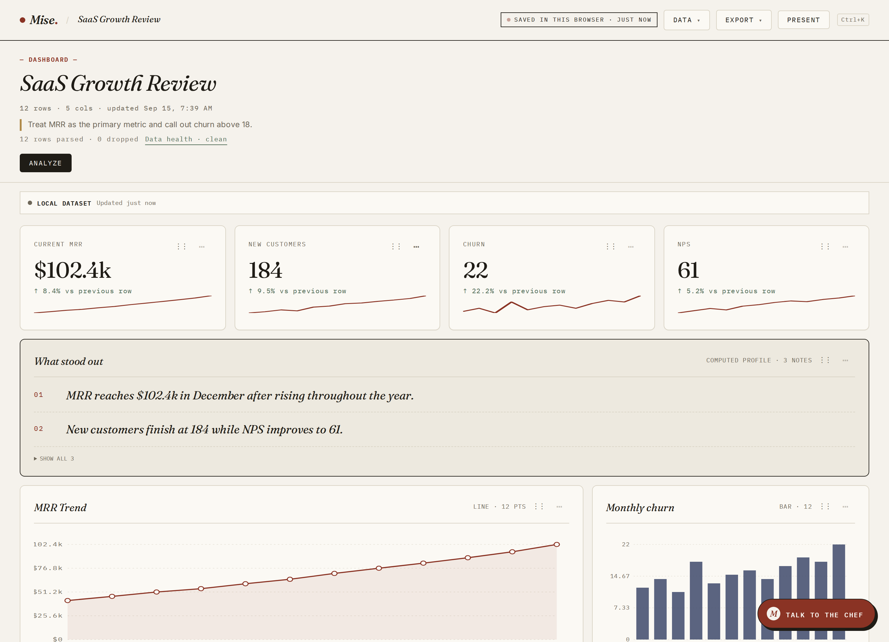
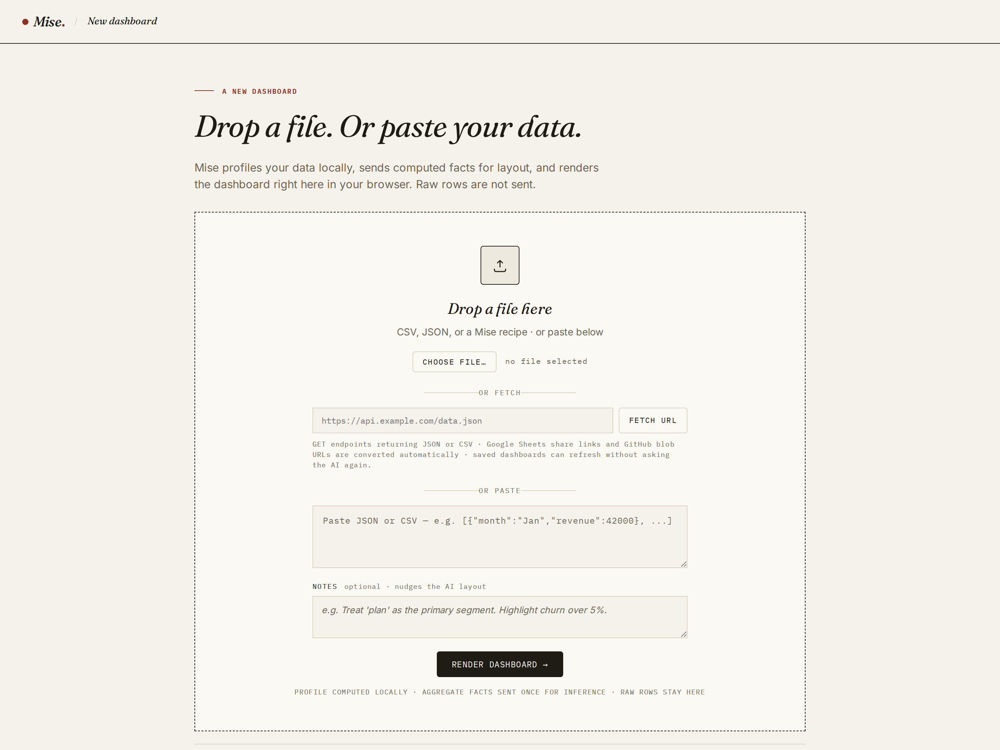
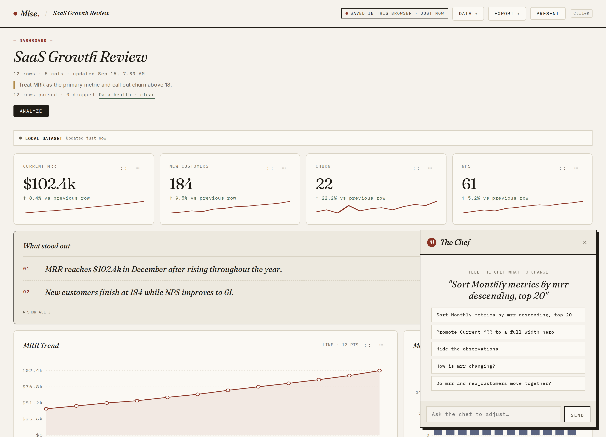
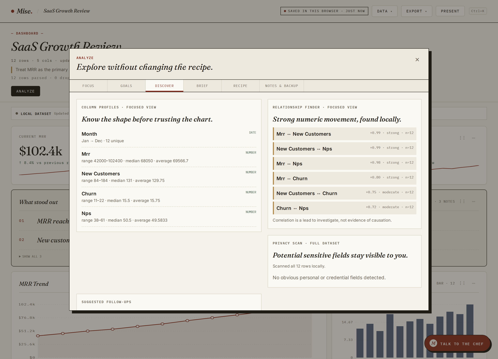
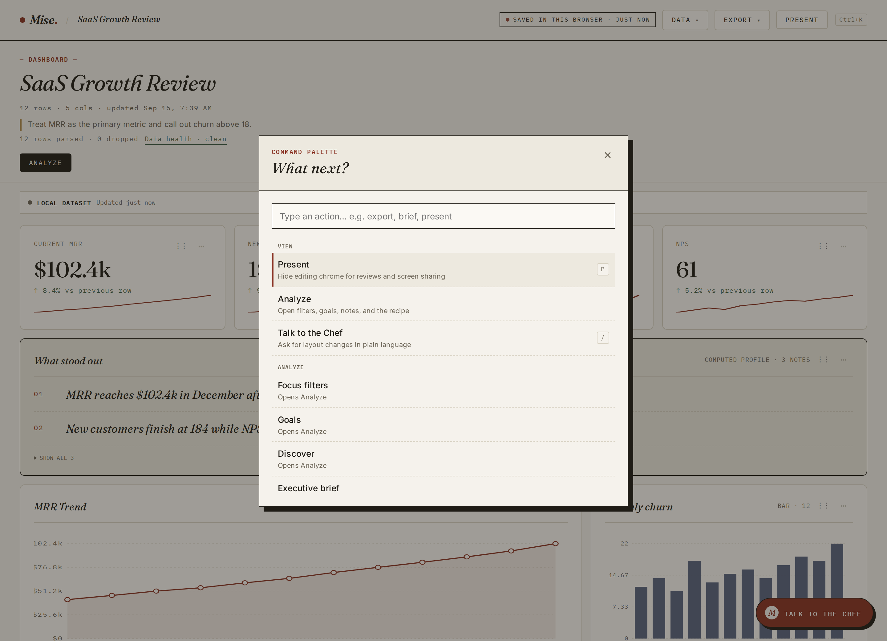
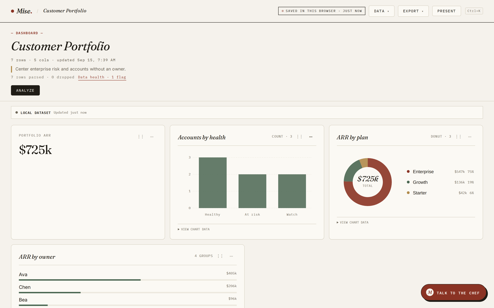
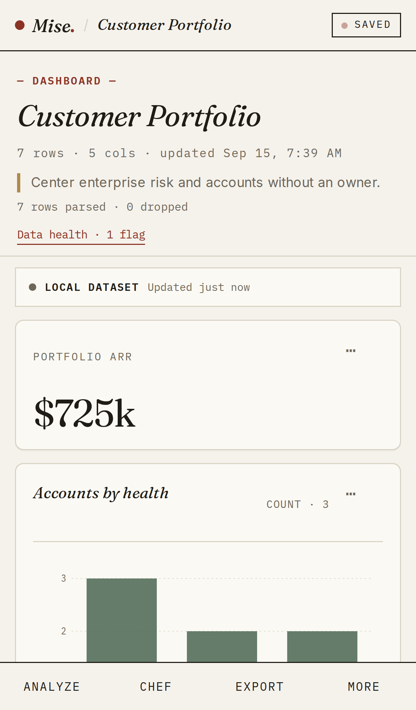

# Mise

**Paste data or a public URL. Get a dashboard. In your browser. We hold the schema, not the rows.**

Mise turns a CSV, a JSON blob, or a public GET endpoint into a laid-out dashboard.
Parsing, profiling, aggregation, and rendering all happen client-side. A model is
asked once to choose the layout — it sees the schema and computed facts, never the
raw rows.

**[Open the app](https://app.mise.seanholung.com)** · [About Mise](https://mise.seanholung.com)



---

## How it works

```
   browser                                  /api/cook (stateless)
   ┌────────────────────────┐               ┌──────────────────────────┐
   │ drop / paste / fetch   │               │  schema + computed facts │
   │          │             │  shape only   │        → layout recipe   │
   │  parse + profile ──────┼──────────────▶│                          │
   │          │             │    recipe     │  no rows, no logging,    │
   │          ◀─────────────┼───────────────│  no storage              │
   │          ▼             │               └──────────────────────────┘
   │ render · edit · export │
   └────────────────────────┘
```

What crosses the network is the inferred schema plus deterministic summaries —
ranges, medians, trends, date spans, and low-cardinality category counts. Raw rows
stay in the tab. There is no account system and no server-side store of your data,
so saved dashboards ("plates") live in `localStorage` under `mise.recents.v1`.

If the model is unreachable, a deterministic planner lays out a dashboard from the
schema alone and says so in a banner. Once a layout exists, the model is out of the
loop: a saved recipe re-runs against new data without another inference call.

---

## Features

**Getting data in.** Drag-and-drop or pick a CSV/JSON file, paste rows directly,
or fetch a public GET endpoint (Google Sheets share links and GitHub blob URLs are
rewritten automatically). Optional notes nudge the layout without commanding it.
Nested JSON is flattened before inference.

**Data health.** Parse results are reported honestly — rows parsed, rows dropped,
and flags for things like mixed date formats or statistical outliers skewing a KPI.
Each flag offers a correction you can apply (treat a column as a date, include
outliers) and records it in an audit trail attached to the dashboard.

**Widgets.** KPI cards with sparklines and deltas, line and bar charts, donuts,
stat lists, count bars, tables with sort/limit transforms, and an evidence-backed
observations brief. Every widget exposes the assumptions behind it — aggregate,
field, format — and the rationale the model gave for choosing it.

**The Chef.** A chat panel that edits the dashboard in plain language ("promote the
first KPI to a full-width hero", "sort the table by date descending, top 20"). Its
suggestions are generated from your actual schema and widgets, and every edit is
undoable.

**Direct editing.** Rename inline, drag to reorder, resize, duplicate, or remove
any widget from its `⋯` menu, with full undo/redo history.

**Analyze.** One panel for exploration that never mutates the recipe: dashboard-wide
focus filters, saved views, KPI goals, context notes, column profiles, a correlation
finder, a local scan for potentially sensitive fields, an executive brief, and a
recipe inspector.

**Cross-filtering.** Click a bar, slice, or stat-list key to focus the whole
dashboard on that value. The chart you clicked keeps all of its groups and
highlights the selection, so clicking another moves the focus in one step.

**Keyboard-first.** `⌘K` opens a command palette covering every action;
`⌘Z`/`⇧⌘Z` undo and redo, `/` jumps to the Chef, `P` presents, `Escape` unwinds
whatever is open.

**Sharing without custody.** Export a PNG, a self-contained interactive HTML file
(with `?embed` mode), the recipe as JSON, a table as CSV or Markdown, or a portable
`.mise.json` backup carrying rows, recipe, filters, views, goals, notes, and theme.
Recipe links contain layout only — no data.

**Recurring reports.** Saved HTTP dashboards refresh while open on a cadence you
choose, compare the new snapshot against the previous one, and evaluate local
threshold alerts.

**Themes and presentation.** Five themes (Mise, Ink, Ocean, Plum, Marketing site)
and a presentation mode that strips every control for review or screen sharing.

---

## Screens

<table>
<tr>
<td width="50%"></td>
<td width="50%"></td>
</tr>
<tr>
<td>Start from a file, a paste, or a URL.</td>
<td>Edit the layout in plain language.</td>
</tr>
<tr>
<td></td>
<td></td>
</tr>
<tr>
<td>Explore without changing the recipe.</td>
<td>Reach every action from the keyboard.</td>
</tr>
</table>

<details>
<summary>More screens</summary>



The same dashboard on a phone, with a bottom action bar:



</details>

---

## Repository layout

| Path | What lives there |
|---|---|
| `frontend/src/domain/` | Pure TypeScript: parsing, schema inference, profiling, aggregation, recipes, insights, formatting, workbench math. No React. |
| `frontend/src/` | The React shell — `App.tsx` (one reducer), `WidgetGrid.tsx`, dialogs, `actions.ts` (every document-level action, once). |
| `frontend/public/docs/` | Static quickstart/examples/about/contact pages served by the app. |
| `lambda/cook.ts` | Stateless proxy exposing `/api/cook`, `/api/fetch-data`, and `/api/events`. |
| `lambda/tests/` | Playwright regression suite driven against the built app. |
| `infra/` | Pulumi program: S3, CloudFront, the Lambda Function URL, DNS, and the rate-limit table. |
| `sample-datasets/` | Larger generated business datasets for manual testing and demos. |
| `eval-datasets/` | Small regression fixtures with explicit renderer expectations. |
| `notes/` | Architecture, scope, backend, vocabulary, and the product roadmap. |

The frontend builds into `public/` (gitignored), which is what both the Playwright
suite and the Pulumi deploy consume.

---

## Getting started

Requires Node 22.

```bash
cd frontend
npm ci
npm run dev          # Vite dev server on http://localhost:5173
```

There is no `/api/cook` in front of the dev server, so rendering falls back to the
deterministic planner — enough to work on parsing, widgets, editing, and exports.
To exercise AI layout locally, point the app at a running proxy or deploy a
preview.

To serve exactly what ships:

```bash
npm run build:public   # emits ../public
python3 -m http.server 8080 --directory ../public
```

Sample data to try: anything in `sample-datasets/`, or open one of the finished
example plates from the gallery on the empty page.

---

## Tests

```bash
cd frontend && npm run typecheck && npm test   # tsc + domain unit tests
cd lambda   && npm test                        # builds public/, then Playwright
```

The domain tests cover the pure modules directly. The Playwright suite drives the
built app in headless Chromium with the model mocked, and asserts behaviour end to
end — including that prompts never contain raw rows.

CI (`.github/workflows/deploy.yml`) runs typecheck, tests, and builds for all three
packages, then previews the Pulumi stack on pull requests and applies it on `main`.

---

## Configuration

The Lambda reads:

| Variable | Purpose | Default |
|---|---|---|
| `LLM_API_KEY` | Credential for the model provider. | — |
| `LLM_BASE_URL` | OpenAI-compatible endpoint. | `https://openrouter.ai/api/v1` |
| `LLM_MODEL` | Model used for layout and Chef edits. | `openai/gpt-5.6-luna` |
| `RATE_LIMIT_TABLE` | DynamoDB table backing shared rate limiting. | in-memory limiter |

Deploys expect `OPENROUTER_API_KEY`, AWS credentials, and `PULUMI_ACCESS_TOKEN` in
the repository secrets.

Mise records small first-party events such as "dashboard rendered" and export type.
Events carry named enums only — never rows, field names, URLs, notes, or Chef text.
Set `mise.telemetry.disabled` to `1` in local storage to opt out.

---

## Further reading

- [`notes/architecture.md`](notes/architecture.md) — stack decisions, deployment, performance budgets, and what we deliberately are not building.
- [`notes/v1-scope.md`](notes/v1-scope.md) — what shipped in v1, what was cut and why, and the AI contract.
- [`notes/backend.md`](notes/backend.md) — the proxy's responsibilities and limits.
- [`notes/product-roadmap.md`](notes/product-roadmap.md) — completed work and what is deferred.
- [`notes/vocabulary.md`](notes/vocabulary.md) — plates, recipes, the Chef, and the rest of the kitchen language.
